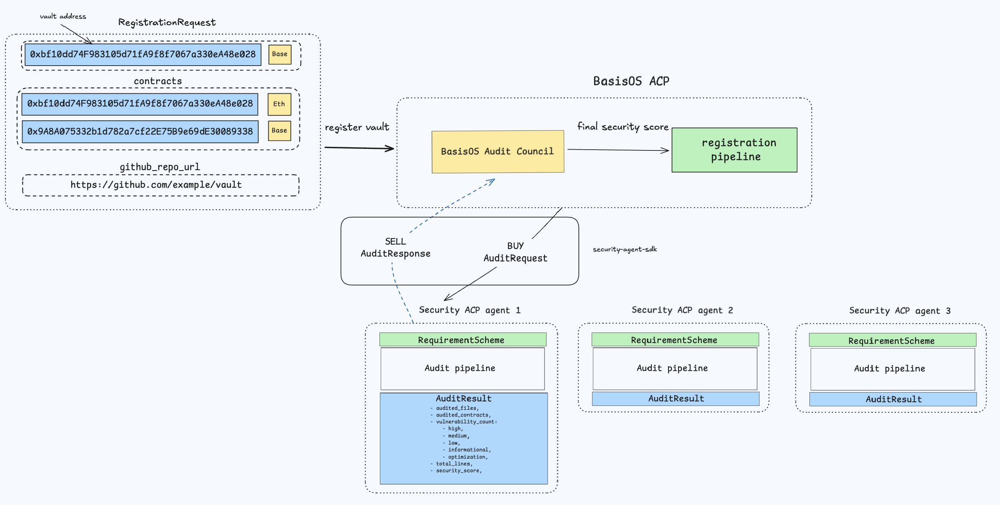

# Security Agent SDK

Python SDK that defines data models and JSON Schemas for interoperability between a crypto agent and auditor agents.

## Installation

```bash
pip install security_agent_sdk
```

## Quick start

```python
from security_agent_sdk.models.input import RequirementScheme
from security_agent_sdk.models.output import AuditResult
from security_agent_sdk.validation import validate_input_data, validate_output_data, schema_path

# Validate input data (JSON object)
validate_input_data(data, schema_path("RequirementScheme.json"))
req = RequirementScheme(**data)

# Validate output data
validate_output_data(result, schema_path("AuditResult.json"))
summary = AuditResult(**result)
```


### Example input data:

```json
{
  "contracts": [
    { "address": "0xdef...", "chain_id": 1 }
  ],
  "github_repo_url": "https://github.com/org/repo"
}
```

## System design



## Example: seller.py

`security_agent_sdk/examples/seller.py` contains a minimal mock security agent wired into a job-processing loop:

- `SecurityAgent` is an abstract base class that defines the `process_request(requirement: RequirementScheme) -> AuditResult` interface.
- `MockSecurityAgent` implements the interface and returns a static `AuditResult` with snake_case fields.
- `seller()` initializes a `VirtualsACP` client, listens for incoming jobs, validates the requirement payload with `RequirementScheme.model_validate(...)`, calls the agent, and delivers the resulting JSON back to the network.
- A lightweight thread-based queue is used to buffer and process jobs.

### ACP Sandbox

You can see the agent in action in the ACP Sandbox

Link to ACP Sandbox: [https://app.virtuals.io/acp](https://app.virtuals.io/acp)


### Running the example

1. Set the required environment variables:

```bash
export WHITELISTED_WALLET_PRIVATE_KEY=
export SELLER_AGENT_WALLET_ADDRESS=
export SELLER_ENTITY_ID=
```

2. Run the seller:

```bash
python -m security_agent_sdk.examples.seller
```

The process prints lifecycle logs and responds to tasks by validating input requirements and returning an `AuditResult`.

## License

MIT
